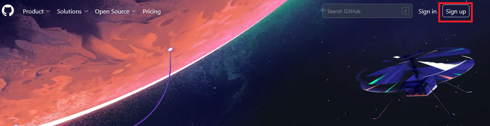
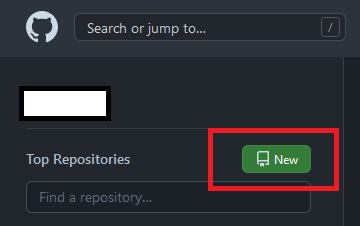
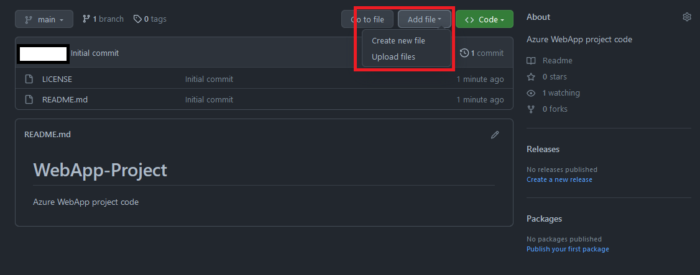
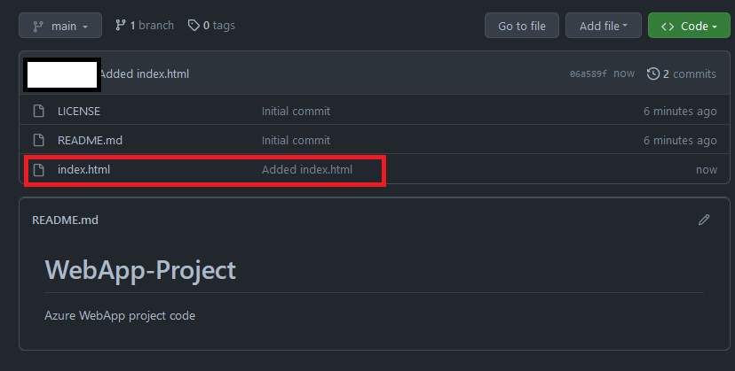

## Day 1 Activity File: Create a GitHub Repository

Today, you will create a GitHub repositoryto showcase your work. Being able to show prospective employers the projects you've worked on throughout class is very important, as it demonstrates the knowledge you've learned. 

### Resources

- [GitHub](https://github.com/)

---

## Instructions

### Part 1: Create a GitHub account

Before creating a repository in GitHub, you must first create an account.

1. Navigate to https://github.com/ and register for an account if you do not already have one. 

	**Note**: Creating an account is free. 
	
	
	
2. After creating an account and signing in, you can create a new repository by clicking on 'New'.

	
	
3. Select yourself as the owner, and then name it according to the project you're working on. For project one, you can name it "WebApp-Project". 
	- Enter a description that describes the project.
	- Ensure the repository is set to "Public" so others can see your work. 
	- Check "Add a README file"
	- Skip "Add .gitignore"
	- For license, choose "MIT License". This allows others to view your work legally.

	

4. After completing your project, you can upload all the files to the repository so people can see what exactly you worked on. To upload files, click on 'Add file', then 'Upload Files'.

	
	
	- Drag the file to the repository and then give a description of what you uploaded. 
	- After the file is uploaded, click 'Commit changes'. 
	
5. Once the change has been committed, it will then reflect in the repository.

	
	
	- Be sure to do this for each project we do in class!

---

© 2022 edX Boot Camps LLC. Confidential and Proprietary. All Rights Reserved.